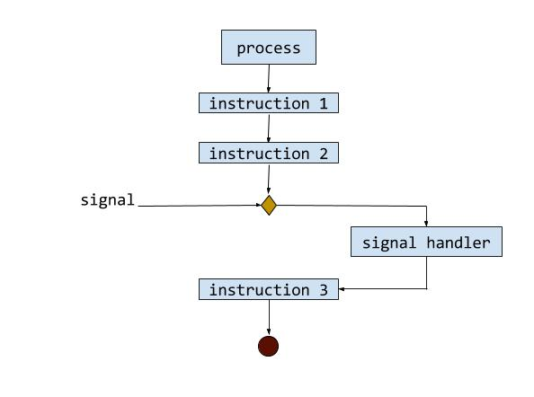

## What are signals

Signals are Software interruptions that happen due to either Software pre-definition or hardware exceptions. For example, it could happen in divisions by zero, or unauthorized attempt of memory access. In general, we can understand signals as way to send information from the OS to our user processes.

## Examples of signals 

Signals will start with the prefix `SIG` , and will have specific use cases. Below is a list with the most common ones:

| signal          | value | description                                                                                                                                                                                                                           |
|-----------------|-------|---------------------------------------------------------------------------------------------------------------------------------------------------------------------------------------------------------------------------------------|
| SIGHUP          | 1     | Hangup (POSIX) Report  that   user's terminal is disconnected. Signal used to report the termination of the controlling process.                                                                                                      |
| SIGINT          | 2     | Interrupt (ANSI) Program interrupt  (ctrl-c)                                                                                                                                                                                          |
| SIGQUIT         | 3     | Quit (POSIX) Terminate  process  and generate core dump.                                                                                                                                                                              |
| SIGILL          | 4     | Illegal Instruction (ANSI) Generally indicates that the executable file is corrupted or use of data where a pointer to a function was expected.                                                                                       |
| SIGTRAP         | 5     | Trace trap (POSIX)                                                                                                                                                                                                                    |
| SIGABRT  SIGIOT | 6     | Abort (ANSI) IOT trap (4.2 BSD) Process detects error and reports by calling abort                                                                                                                                                    |
| SIGBUS          | 7     | BUS error (4.2 BSD) Indicates an access to an invalid address.                                                                                                                                                                        |
| SIGFPE          | 8     | Floating-Point arithmetic Exception (ANSI). This includes division by zero and overflow. The IEEE Standard for Binary Floating-Point Arithmetic (ANSI/IEEE Std 754-1985) defines various floating-point exceptions                    |
| SIGKILL         | 9     | Kill, unblockable (POSIX)  Cause immediate program termination. CanNot  be handled, blocked or ignored.                                                                                                                               |
| SIGUSR1         | 10    | User-defined signal 1                                                                                                                                                                                                                 |
| SIGSEGV         | 11    | Segmentation Violation (ANSI) Occurs  When a program tries to read or write outside the memory that is allocated for it by the operating system, dereferencing a bad or NULL pointer. Indicates  an   invalid access to valid memory. |
| SIGUSR2         | 12    | User-defined signal 2                                                                                                                                                                                                                 |
| SIGPIPE         | 13    | Broken pipe (POSIX) Error  condition  like trying to write to a socket which is not connected.                                                                                                                                        |
| SIGALRM         | 14    | Alarm clock (POSIX) Indicates expiration of a timer. Used by the alarm() function.                                                                                                                                                    |
| SIGTERM         | 15    | Termination (ANSI) This signal can be blocked, handled, and ignored. Generated by "kill" command.                                                                                                                                     |
| SIGSTKFLT       | 16    | Stack fault                                                                                                                                                                                                                           |
| SIGCHLD  SIGCLD | 17    | Child status has changed (POSIX)  Signal  sent   to parent process whenever one of its child processes terminates or stops. See  the  YoLinux.com Fork, exec, wait, waitpid tutorial                                                  |
| SIGCONT         | 18    | Continue (POSIX) Signal sent to process to make it continue.                                                                                                                                                                          |

## Visual representation

As show below, the signal comes from outside the process. It will stop the current flow of the process so that it can be handled, and then it will go back to where it was before the signal.

