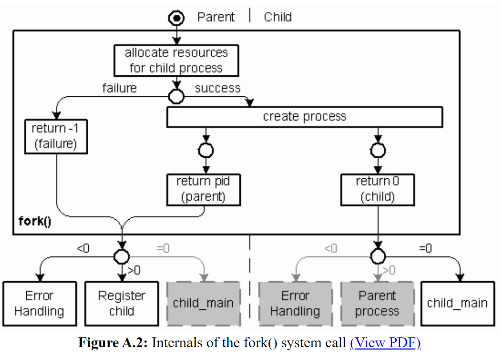

```
pid_t fork(void)
```

In traditional Unix the only way to create a process is using the  `fork()` system call. The new process gets a copy of the current program, but new process id (`pid`). The process id of the parent process (the process that called  `fork()`) is registered as the new processes parent `pid` (ppid) to build a process tree.

In the parent process,  `fork()` returns and delivers the new processe's `pid` as a result.

The new process also returns from the  `fork()` system call (because that is when the copy was made), but the result of the  `fork()` is 0.

> So  `fork()` is a special system call. You call it once, but the function returns twice: Once in the parent, and once in the child process.  `fork()` increases the number of processes in the system by one.

Every Unix process always starts their existence by returning from a  `fork()` system call with a 0 result, running the same program as the parent process. They can have different fates because the result of the  `fork()` system call is different in the parent and child incarnation, and that can drive execution down different if() branches.

In Code:

```c
#include <stdio.h>
#include <unistd.h>
#include <stdlib.h>
 
int main() {

        pid_t pid =  fork();

        if (pid < 0) {
                perror("In  fork():");
                return -1;
        }
        
        if (pid == 0) {
                printf("I am the child.\n");
        }

        if (pid > 0) {
                printf("I am the parent, the child is %d.\n", pid);
        }

        return 0;
}
```

Running this, we get:

```
pedro@ubuntu:~/Desktop/superprof/guilherme/aula-01/fork$ gcc ex01.c -o ex01
pedro@ubuntu:~/Desktop/superprof/guilherme/aula-01/fork$ ./ex01
I am the parent, the child is 3764.
I am the child.
```

We are defining a variable `pid` of the type pid_t. This variable saves the `fork()` result, and using it we activate one (“I am the child.”) or the other (“I am the parent”) branch of an if().

Running the program we get two result lines. Since we have only one variable, and this variable can have only one state, an instance of the program can only be in either one or the other branch of the code. Since we see two lines of output, two instances of the program with different values for `pid` must have been running.

If we called getpid() and printed the result we could prove this by showing two different `pids`.

## Visual representation

If we abstract things and see only the blocks containing this example, it would look something like this:


And when it comes to sequence in the actual code, this is what happens:


